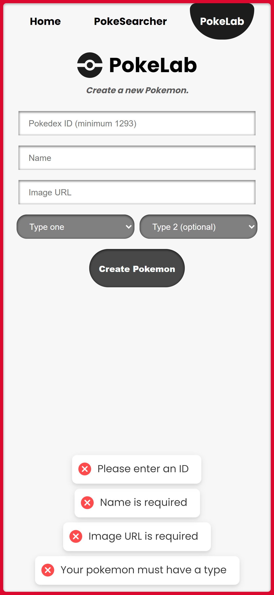
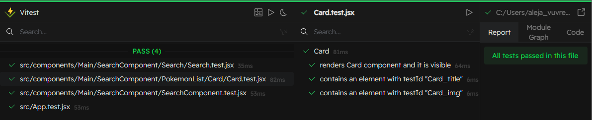

# PokeApp React

[PokeApp](https://pokeapp-react-axeloth.netlify.app/) is a React application that interacts with the [PokeAPI](https://pokeapi.co/) to provide an interactive experience for Pokémon fans. This application utilizes React functional components and hooks like `useState()`, `useEffect()`, `useContext()`, and `useParams()` to manage state and side effects.

## Features

- **Search Functionality**: Users can search for Pokémon by name or ID.
- **Debounced Search**: Enhanced search experience with debounced input to optimize API calls.
- **Pokémon Listing**: Dynamically generated list of Pokémon with detailed information.
- **Dynamic Color Themes**:  According to the primary type of the pokemon.
- **SASS** - For styling, mobile-first.
- **Routing**: Clean and navigable UI with React Router.
- **Form Handling**: Add new Pokémon using `react-hook-form`.
- **Toast Notifications**: Beautiful notifications when creating a new Pokemon using [React Hot Toast](https://github.com/timolins/react-hot-toast).
- **Unit Testing**: Components tested using Vitest.
- **Web deployment on Netlify**: https://pokeapp-react-axeloth.netlify.app/


## Web Preview

### Search
- Users can search for Pokémon by name or ID. 
- Leaving a correct pokemon name or id in the search input for 2 seconds will trigger the search.
- Automatically checks that the pokemon to search is not already in the list.
- Dynamic hover animation for the different cards.

 


### Details
- Detailed view for a specific pokemon.
- Dynamic color theme depending on the primary type of the pokemon.
- The name, id, image and types are passed through query params (search/id?name=...)
- The rest of the details (bio, stats) are fetched from the PokeAPI.
- If no details are found (like when viewing your custom Pokemon), a *No details found* message appears.


### Pokemon Creation
- Create your own new Pokemon with a simple form, and see how it gets displayed alongside the rest of your Pokemons.
- Custom notifications alert you of the different requisites for the name, id and other parameters.


 

## Vitest Unit Testing
Basic testing done using Vitest for the main components.




## Try it yourself

To get a local copy up and running, follow these simple steps.

### Prerequisites

Before you begin, ensure you have the latest version of npm installed:

```sh
npm install npm@latest -g
```

### Installation

1. Clone the repository:
   ```sh
   git clone https://github.com/AxelothLeohryn/pokeapp-react.git
   ```
2. Navigate to the project directory:
   ```sh
   cd PokeApp
   ```
3. Install NPM packages:
   ```sh
   npm install
   ```

### Running the Application

Start the development server:

```sh
npm run dev
```

The application will be available at `http://localhost:5173`.


## Built With

- [React](https://reactjs.org/) - The web framework used
- [PokeAPI](https://pokeapi.co/) - API for Pokémon data
- [React Router](https://reactrouter.com/) - For navigation and routing
- [React Hook Form](https://react-hook-form.com/) - For form handling and validation
- [SASS](https://sass-lang.com/) - For styling
- [React Hot Toast](https://github.com/timolins/react-hot-toast) - For notifications
- [Vitest](https://vitest.dev/) - For unit testing of basic components.


## Authors

- **Alejandro Sanchez** - [AxelothLeohryn](https://github.com/AxelothLeohryn)


Thank you for taking a look at my project ❤️!


